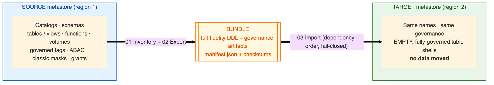
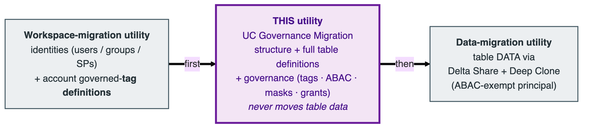

# 🛡️ UC Governance Migration Utility

> A **notebook-based**, **config-driven** utility that migrates **Unity Catalog structure +
> governance** — catalogs, schemas, full table definitions, functions, views, volumes, and the
> **tags · ABAC · classic masks · grants** that protect them — from a **source** metastore
> (region 1) to a **target** metastore (region 2). It runs **entirely inside Databricks** (no
> terminal, no local Python) and **never moves table data**: it creates empty, fully-governed
> table shells for a separate data-migration utility to fill.

<p>


</p>

---

## 📖 Documentation

**👉 Start at the [Documentation Hub](docs/README.md).** Then pick your path:

| Guide | What it covers | Read it if you… |
|-------|----------------|-----------------|
| 🏗️ **[Architecture & Working Model](docs/ARCHITECTURE.md)** | How migration works end-to-end; `direct` vs `airgap`; the bundle; dependency order; fail-closed governance; scope | …want to understand *how* it works |
| ⚙️ **[Configuration Guide](docs/CONFIGURATION_GUIDE.md)** | Every widget & config option, with defaults and examples | …are filling in widgets / job params |
| 📋 **[Runbook](docs/RUNBOOK.md)** | Scenario-by-scenario, step-by-step instructions for a real migration | …are about to run a migration |
| 🔐 **[Permissions Guide](docs/PERMISSIONS_GUIDE.md)** | The **catalog-scoped, no-metastore-admin** grants each SP needs | …need to request access first |
| 📦 **[Object Support Matrix](docs/object-support-matrix.md)** | Per-object: created? governed? notes | …need to know whether object X is handled |

---

## 🎯 Summary

Migrates **non-data** Unity Catalog assets — structure + governance — from a source metastore to a
target metastore on the **same cloud, across regions (Azure region → Azure region)**:



It is **additive and idempotent**, with **auto-detected incremental (delta) sync**: on the first
run it seeds a Delta state table; later runs diff each object's DDL / governance / grant
fingerprints and apply **only the deltas** — new objects are **created**, changed objects
**updated**, unchanged objects **skipped** (zero writes), and removals **reported, never applied**.

> ⚠️ **It never moves table data.** It reproduces every table's *full definition* (columns,
> comments, `TBLPROPERTIES`, partitioning, clustering, constraints, generated & identity columns —
> everything except the rows) and all of its governance, then hands empty shells to the
> data-migration utility. Full scope → [Architecture › Scope](docs/ARCHITECTURE.md#-scope--what-is-and-isnt-migrated).

## 🧩 One of three utilities in a region move



| Utility | Owns |
|---|---|
| Workspace-migration | Identities (users / groups / SPs) + **account-level governed-tag definitions** |
| **This utility** | UC structure + full table definitions + governance (tags, ABAC, classic masks, grants) |
| Data-migration | Table **data** via Delta Share + Deep Clone (run as an ABAC-exempt principal) |

## 🔀 Two connectivity modes

| Mode | Where stages run | How the source is read | The bundle hop |
|------|------------------|------------------------|----------------|
| **`direct`** *(default)* | `03` in the target; `01`/`02` read the source over REST | REST + the **source** SQL warehouse (for DDL / ABAC capture) | **None** — one end-to-end Job |
| **`airgap`** | `01`/`02` in **source**, `03` in **target** | Runs *inside* the source workspace | Ops **physically moves** the `run_<id>/` bundle |

Both modes produce the **identical bundle**, so import is mode-agnostic. Details →
[Architecture › The two modes](docs/ARCHITECTURE.md#-the-two-connectivity-modes).

## 🚀 The notebooks

| Notebook | Stage | Runs in |
|----------|-------|---------|
| `notebooks/00_Install_Jobs.py` | Idempotent Jobs installer (deploys `jobs/*.json`) | Target (or either side, per job) |
| `notebooks/01_Inventory.py` | Read-only enumeration + tags/ABAC/grants capture | Source *(airgap)* / Target-reads-source *(direct)* |
| `notebooks/02_Export.py` | Full-fidelity DDL capture (SQL warehouse) → bundle + path-rewrite | Source *(airgap)* / Target-reads-source *(direct)* |
| `notebooks/03_Import.py` | Replay on target in dependency order, governed + fail-closed | Target |

> ⚠️ **SQL warehouses are required.** Export runs `SHOW CREATE` on `source_warehouse_id` in *both*
> modes; import runs its **entire replay** on a single serverless `import_warehouse_id` (required —
> the import fails fast without it). See [Configuration](docs/CONFIGURATION_GUIDE.md).

**New here? Go straight to the [Runbook](docs/RUNBOOK.md).**

## 🗂️ Repository layout

```
notebooks/   00_Install_Jobs · 01_Inventory · 02_Export · 03_Import   (thin; widgets only)
jobs/        *.json           Declarative Jobs specs installed by 00_Install_Jobs
src/uc_sync/ config · inventory · export · governance · sql_ddl · rewrite
             package_import · dependency · mapping · location_mapping
             audit · sync_state · delta · volume_copy · report · auth · preflight
docs/        this documentation set (+ diagrams/)
plans/       design & bugfix plans
VERSION      single source of truth for the SemVer version
```

## 🏷️ Versioning

The utility follows [Semantic Versioning](https://semver.org/) (`MAJOR.MINOR.PATCH`). The number
lives in one place — the root [`VERSION`](VERSION) file — read by `src/uc_sync/__init__.py` and
stamped into every bundle's `manifest.json`, `uc_sync_audit`, and `uc_sync_state`, so each artifact
records exactly which build produced it. Record every change in the root
**[CHANGELOG.md](CHANGELOG.md)**.
