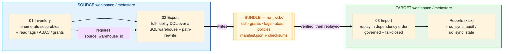
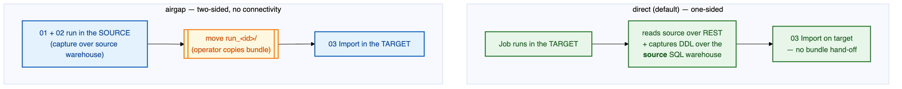
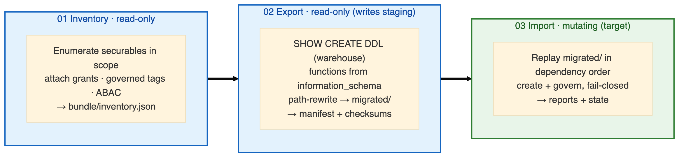
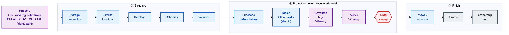
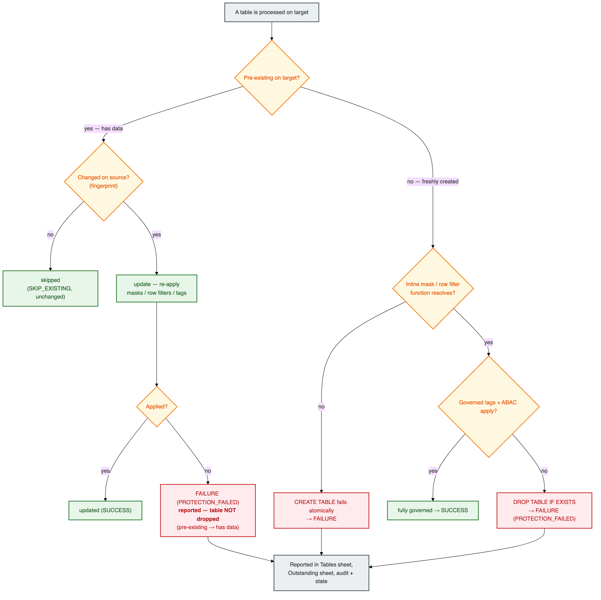
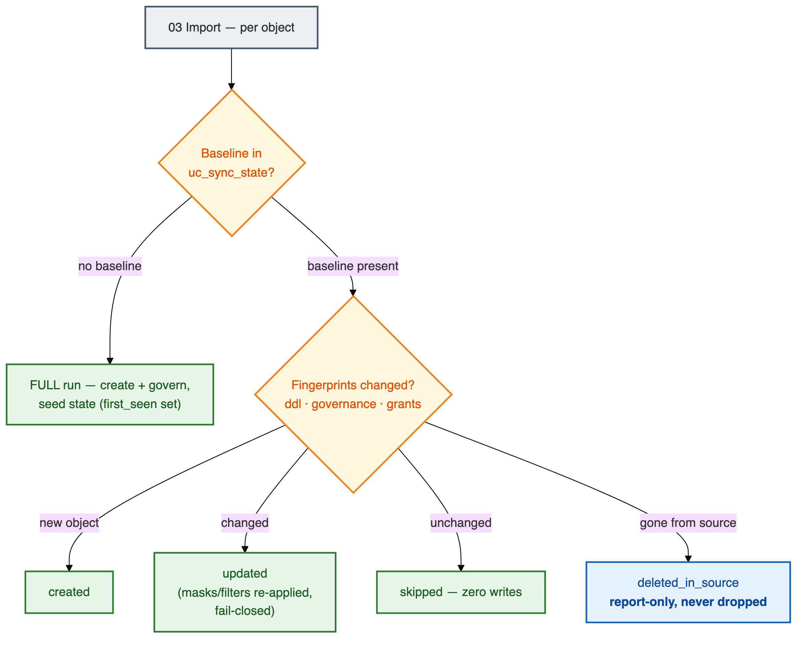

# 🏗️ Architecture & Working Model

How the UC Governance Migration Utility works end-to-end: both connectivity modes, the bundle it
produces, the order it recreates objects in, how governance is applied **fail-closed**, and exactly
what is (and isn't) migrated.

> **New to the tool?** This is the right place to start. The [Runbook](RUNBOOK.md) tells you
> *how to run it*; this document tells you *how it works*.

## 📖 Contents

1. [The big picture](#-the-big-picture)
2. [One of three utilities](#-one-of-three-utilities-in-a-region-move)
3. [The two connectivity modes](#-the-two-connectivity-modes)
4. [The pipeline stages](#-the-pipeline-stages)
5. [The bundle](#-the-bundle-the-only-thing-that-moves)
6. [Warehouse-only DDL capture (no silent downgrade)](#-warehouse-only-ddl-capture-no-silent-downgrade)
7. [Object dependency order](#-object-dependency-order)
8. [Fail-closed governance](#-fail-closed-governance-the-core-guarantee)
9. [Additive & incremental runs](#-additive--incremental-runs)
10. [The preflight gate](#-the-preflight-gate)
11. [Reporting & state model](#-reporting--state-model)
12. [Scope — what is & isn't migrated](#-scope--what-is-and-isnt-migrated)
13. [Names, mapping & compute](#-names-mapping--compute)

---

## 🔭 The big picture

The utility reads a **source** metastore, writes a portable **bundle**, and recreates those objects
on a **target** metastore — in dependency order, governed, fail-closed, idempotent, with ownership
transferred last. It **never moves table data**: every table is recreated as an empty, fully-governed
shell.



**Design principles:**

| Principle | What it means in practice |
|-----------|---------------------------|
| **Notebook-only** | Runs entirely inside Databricks. No terminal, no local Python, no bundled CLI. |
| **Config-driven & generic** | No customer- or metastore-specific values in code — everything is a widget / job param. |
| **The bundle is the contract** | Both modes emit an identical, self-describing bundle. Import never cares which mode produced it. |
| **Full fidelity or fail** | DDL comes from `SHOW CREATE` on a warehouse; a failed capture is a hard failure, never a lossy synthesized fallback. |
| **Fail-closed governance** | A governed table that can't be fully protected never survives on the target. |
| **Additive + incremental** | Every object is fingerprinted against a Delta state table. Re-runs are expected and safe; removals are reported, never applied. |
| **Catalog-scoped, no admin** | Neither service principal is ever a metastore or account admin. |

---

## 🧩 One of three utilities in a region move

This utility owns exactly one slice of a cross-region Unity Catalog move. It assumes the other two
slices are handled by their own utilities, and it **hands off cleanly** to the data migration.


| Utility | Owns | Relationship to this tool |
|---------|------|---------------------------|
| **Workspace-migration** | Identities (users / groups / SPs) + **account-level governed-tag definitions** | Runs **first**. This tool assumes **principals** already exist on the target (grants hard-fail otherwise). Governed-tag **definitions** it will **recreate itself** (Phase 0, best-effort) from what it captured on the source — but workspace-migration is their authoritative account-level owner, and if this tool can't capture or create one, `SET TAGS` fails `GOVERNANCE_PREREQ_MISSING`. |
| **This utility** | UC structure + full table definitions + governance (tags, ABAC, classic masks, grants) | Produces empty, fully-governed shells. |
| **Data-migration** | Table **data** via Delta Share + Deep Clone (run as an ABAC-exempt principal) | Runs **after** — fills the shells this tool created. |

> 🧠 **Why data is separate:** cloning data through governance is a data-plane concern with its own
> exempt-principal and Deep-Clone semantics. Keeping structure/governance in one tool and data in
> another means each can be re-run independently, and a governance change never forces a data reload.

---

## 🔀 The two connectivity modes

The deployment model isn't fixed, so the tool supports **two modes**, chosen by the
`connectivity_mode` widget. They differ in only two things: **who reads the source**, and **whether
the bundle hop is manual**.



### Mode A — `direct` (default, one-sided)

`03_Import` runs in the **target**; `01_Inventory` / `02_Export` run there too but **read the source
over REST** and **capture DDL over the source SQL warehouse** (`source_warehouse_id`). The bundle is
written straight to `output_volume_path` — **no manual hop** — so the whole migration can run as one
end-to-end Job. A real region move points at a remote source (`source_workspace_url` + source SP
credentials); a same-workspace smoke test leaves those blank but still needs `source_warehouse_id`.

### Mode B — `airgap` (two-sided, NO connectivity)

There is **no network path** between source and target. `01`/`02` run **inside the source**
(capturing over a source SQL warehouse) and write the bundle to a source volume; an operator
**physically moves** the `run_<id>/` directory to a target-readable volume; `03` runs **inside the
target**. Each side authenticates only to its own workspace — no cross-workspace call, ever.

### ⚖️ Side-by-side

| Aspect | `airgap` | `direct` *(default)* |
|--------|----------|----------------------|
| **Where `01`/`02` run** | Source workspace | Target workspace (reading the source) |
| **Where `03` runs** | Target workspace | Target workspace |
| **Source↔target connectivity** | ❌ none (by design) | ✅ target → source over REST |
| **SQL warehouse for export** | ✅ source warehouse (required) | ✅ source warehouse (required) |
| **Bundle hop** | ✅ manual (ops moves `run_<id>/`) | ❌ none |
| **Can be one Job?** | No (two sides) | ✅ yes (end-to-end) |
| **Bundle produced** | 🟰 identical | 🟰 identical |

> 🧠 **Why it doesn't matter for import:** both modes emit the same bundle, so `03_Import` is 100%
> mode-agnostic. The mode is recorded in the manifest and in `uc_sync_state.connectivity_mode`; only
> `01`/`02` and the source-auth client builder are mode-aware.

---

## 🔧 The pipeline stages



| Stage | Notebook | Reads | Writes | Mutating? |
|-------|----------|-------|--------|-----------|
| **Inventory** | `01_Inventory` | Source over REST + warehouse | `bundle/inventory.json` + report | ❌ read-only |
| **Export** | `02_Export` | Source over the SQL warehouse | The bundle (`export/` + `migrated/`) + manifest | ❌ (writes staging only) |
| **Import** | `03_Import` | The bundle | Target metastore + state/audit tables | ✅ (unless `dry_run`) |

- **Inventory** enumerates securables in scope over REST, then attaches **grants** (permissions API)
  and **governed tags + ABAC policies** (SQL: `information_schema.*_tags`, `abac_policy_definitions`
  + `DESCRIBE POLICY`). Governance reads run **on `source_warehouse_id`** — a classic job cluster
  cannot read `information_schema.abac_policy_definitions`.
- **Export** captures full-fidelity DDL over the warehouse, reassembles functions from
  `information_schema`, then **path-rewrites** every ADLS path to the target roots, writing a
  replay-ready `migrated/` tree alongside `manifest.json` + `checksums/`.
- **Import** replays `migrated/` in dependency order, honoring the `create_*` / `apply_*` toggles,
  governed and fail-closed.

---

## 📦 The bundle (the only thing that moves)

Every run writes a **run-isolated, self-describing** `run_<id>/` directory. In `airgap` mode this is
literally the only thing that crosses between workspaces.

```
run_<id>/
├── bundle/
│   └── inventory.json          ← self-describing inventory from 01
├── export/run_<id>/            ← the captured bundle
│   ├── ddl/                       SHOW CREATE per object
│   ├── grants/                    permission grants per securable
│   ├── tags/                      governed-tag assignments
│   ├── abac/                      ABAC policy definitions (verbatim, incl. EXCEPT)
│   ├── policies/                  classic column masks / row filters
│   ├── metadata/                  per-object metadata (types, locations, fingerprints)
│   └── checksums/
├── migrated/                   ← path-rewritten copy replayed by Import
├── reports/                    ← inventory.xlsx · export.xlsx · import.xlsx
├── manifest.json               ← object list, counts, checksums, source ids, tool version
└── checksums/
```

> 📁 The layout lives in one place; every read/write goes through it, so a path change is a one-line
> change. **Why self-describing?** `manifest.json` (counts + checksums + `utility_version`) lets the
> target **verify the upload arrived complete** before it acts — a partial upload must never present
> as a partial migration.

---

## 🗄️ Warehouse-only DDL capture (no silent downgrade)

Export **requires a SQL warehouse** (`source_warehouse_id`) in **both** modes: `direct` reaches the
source warehouse over REST, `airgap` builds a local executor over the source warehouse. `SHOW CREATE`
runs reliably on governed (masked / row-filtered) tables on a warehouse but is flaky on a classic
Spark cluster, so the classic-Spark capture path **does not exist**.

| Object family | Capture | On failure |
|---------------|---------|-----------|
| **Table / view family** (`TABLE`, `EXTERNAL_TABLE`, `VIEW`, `DYNAMIC_VIEW`, `MATERIALIZED_VIEW`, `STREAMING_TABLE`) | `SHOW CREATE` on the warehouse (retries + backoff) — the **only** full-fidelity source: columns/types/nullability, comments, **inline `MASK` / `WITH ROW FILTER`**, `TBLPROPERTIES`, partitioning, clustering, constraints, generated & identity columns | **Hard `FAILURE`** (`DDL_CAPTURE_FAILED`) — **no** synthesized fallback (that would silently drop masks / filters / constraints). Re-run once the warehouse is warm. |
| **Functions** | Reassembled from `information_schema.routines` + `.parameters` (lossless; `SHOW CREATE FUNCTION` is unsupported in Databricks SQL) | reported failure |
| **Catalogs / schemas / volumes / external locations** | Metadata-based (complete — no `SHOW CREATE` needed) | — |
| **Storage credentials** | REST / API only (`CREATE STORAGE CREDENTIAL` has no SQL form; secrets are never exported) | non-MI → `MANUAL_ACTION_REQUIRED` |

---

## 🔗 Object dependency order

Objects are recreated in an order that respects their dependencies and makes protection **early and
atomic**. **Governance is interleaved**, and a **drop sweep** removes anything that failed to be
protected before dependents (views) are built.



| # | Phase | Notes |
|---|-------|-------|
| 0 | **Governed tag definitions** | `CREATE GOVERNED TAG … VALUES(…)` — recreated on the target from the source's captured definitions, **idempotent** (already-present → `SKIP_EXISTING`) and best-effort. Runs first because `SET TAGS` (step 8) needs the definition to exist. Gated by `apply_tags`. |
| 1 | **Storage credentials** | REST/API; created only when `create_storage_credentials=true` |
| 2 | **External locations** | created only when `create_external_locations=true` |
| 3 | **Catalogs** | Created only when `create_catalogs=true`; its `MANAGED LOCATION` (the ADLS storage path) is **path-rewritten from the source path to the target** via the mapping — the location is kept, not stripped |
| 4 | **Schemas** | Created only when `create_schemas=true`; `MANAGED LOCATION` from `object_locations.csv` or the catalog root |
| 5 | **Volumes** | managed + external; files not copied (unless `copy_volume_data=true`) |
| 6 | **Functions** | **before tables**, so a table's inline `MASK` resolves at `CREATE TABLE` time |
| 7 | **Tables** | classic masks / row filters ride **INLINE** in `CREATE TABLE` (atomic) |
| 8 | **Governed tags** | `SET TAGS`; **fail → drop the table** |
| 9 | **ABAC policies** | on `import_warehouse_id`; **fail → drop the table** |
| 10 | **Drop sweep** ⭐ | remove every freshly-created table a governance step failed on |
| 11 | **Views / matviews** | on the SQL warehouse; a view on a dropped table simply fails naturally |
| 12 | **Grants** | replayed as-is |
| 13 | **Ownership** | **last** — transferring ownership earlier would strip the run principal's `CREATE MANAGED STORAGE` mid-run |

> 🔀 **Two moves make protection atomic:** functions are created *before* tables (a missing mask
> function fails the `CREATE` — no unprotected table survives), and views are created *after*
> governance + the drop sweep (a view built on a dropped governed table fails naturally, with no
> cascade code). Ownership is deferred to the very end so the run principal keeps
> `CREATE MANAGED STORAGE` through catalog/table creation.

---

## 🔒 Fail-closed governance (the core guarantee)

**North star: a governance change that does not land on the target must never read as success.** A
*governed* table — one with ≥1 classic mask, row filter, ABAC policy, or governed tag — that cannot
be fully protected **never survives** on the target.



| Situation | Outcome |
|-----------|---------|
| Inline `MASK` / `WITH ROW FILTER` function missing (**freshly-created** table) | `CREATE TABLE` **fails atomically** — no unprotected table is ever created |
| Governed-tag or ABAC apply fails on a **freshly-created** table | `DROP TABLE IF EXISTS` → `FAILURE` (`PROTECTION_FAILED`); reported in the Tables sheet, the **Outstanding** sheet, `uc_sync_audit`, and `uc_sync_state` |
| **Pre-existing** table **changed** on source, and re-applying its mask / filter / tags **fails** (incremental) | Marked `FAILURE` (`PROTECTION_FAILED`) **in place and reported** — the table is **never dropped** (it holds data). Fix the cause and re-run. |
| **Pre-existing** table **unchanged** | `SKIP_EXISTING` — never dropped, never destructively re-governed; governance is additive |

The distinction is the invariant: **only a shell this run freshly created is ever dropped**. A
pre-existing table (it may already hold cloned data) is **never dropped** — a failed protection on it
is marked `FAILURE` in place and surfaced, so it still never reads as a silent success.

A governance failure is **never a green run**: `03_Import` exits non-zero (the report + audit/state
are still written).

> **The whole import runs on one SQL warehouse.** `import_warehouse_id` is **required** — the entire
> import replay (tables, functions, masks / row filters, views, materialized views, ABAC, tags,
> grants) runs on a single serverless SQL warehouse, so there is no classic-Spark DDL path at all.
> That's why `CREATE POLICY` and a `CREATE VIEW` over a masked/row-filtered base table — both rejected
> on classic Spark — succeed here. (A UC column mask is bound to the base table and evaluated on every
> read, *including through a view*, against the querying user.) The import **fails fast** if
> `import_warehouse_id` is unset.

---

## ♻️ Additive & incremental runs

The same metastore pair is migrated **many times over its life** (new tables, edited policies, new
grants). The run mode is **auto-detected** from the `uc_sync_state` Delta table.



- **First run** (no baseline) → a **full** run that creates + governs everything and **seeds** state
  (each object's `first_seen` is set).
- **Later runs** → diff each object's three fingerprints and apply **only deltas**: new → **created**,
  changed → **updated** (masks/filters re-applied, still fail-closed), unchanged → **skipped** (zero
  writes).
- **Removals are report-only.** A source object or grant that disappeared is surfaced as
  `deleted_in_source` — **never revoked or dropped** on the target. This includes a mask/row filter
  removed on source: reported, never a `DROP MASK` / `DROP ROW FILTER`.

### The three fingerprints (documented on `uc_sync_state`)

| Fingerprint | Covers | Changes when… |
|-------------|--------|---------------|
| **`source_definition_hash`** | The object's authoritative source definition | any inventoried definition changes |
| **`ddl_hash`** | The captured `SHOW CREATE` DDL — **inline masks / row filters live here** | columns, comments, properties, or an **inline mask/filter** change |
| **`governance_hash`** | Governed **tags** only | a tag assignment changes |

> There is **no `force_full` widget** — incremental is automatic. To force a full re-seed, reset the
> baseline (see the [Runbook](RUNBOOK.md#-re-running-additive--incremental)).

---

## 🚦 The preflight gate

Before real work, each stage runs a **graded environment preflight** (`preflight_enforce`, default
`true`). It is verify-only and returns a graded verdict, so the tool never *silently* degrades:

| Grade | Meaning | Example |
|-------|---------|---------|
| 🔴 **NO-GO** | The run cannot produce a correct result | The Excel report library (`openpyxl`) missing · the SQL warehouse unreachable |
| 🟢 **GO** | Safe to proceed | — |

With `preflight_enforce=true` a NO-GO is a **red run** (never a green run that quietly skipped its
report). Setting it `false` downgrades a NO-GO to a loud warning.

---

## 📊 Reporting & state model

The report and the state table share **one status vocabulary** (`last_action`) — the same value is
stored in `uc_sync_state.last_action` and rendered verbatim in the report, so the two never disagree.

### Report sheets

| Sheet | Shows |
|-------|-------|
| **Summary** | Current-run **Failures (N)**, **Manual steps**, **Deleted in source**, and the unchanged/skip counts |
| **Per-object-type sheets** | Catalogs · Schemas · Volumes · Functions · Tables · Views · Storage Credentials · External Locations — action + status + notes per object; `deleted_in_source` objects appear here as a trailing section |
| **ABAC Policies** / **Column Masks & Row Filters** | Per-policy apply status (applied / failed) |
| **Governed Tags Applied** | Per-tag apply status (or `— (no tag op this run)`) |
| **Outstanding** | **Cumulative** failures from `uc_sync_state` (`last_action = failed`) across all runs — the authoritative "still broken" view |

`last_action` vocabulary: `created` · `updated` · `adopted` · `skipped` (incl.
`Skipped (create disabled)` and Skipped-with-comment variants for a source column drop / type
change) · `created_with_warning` · `manual` · `deleted_in_source` · `skipped_no_object` · `failed`.

### Metadata tables (in `ops_catalog.ops_schema`)

| Table | Purpose | Key columns |
|-------|---------|-------------|
| **`uc_sync_audit`** | Append-only run/event log | run id, stage, event, `utility_version`, timestamps |
| **`uc_sync_state`** | Per-object baseline for incremental sync | the **three fingerprints**, `last_action`, `first_seen`, `connectivity_mode`, `failure_category`, `last_error_raw`, `grants_json`, ddl/grants paths |
| **`uc_sync_volume_files`** | Optional volume-file copy ledger (`copy_volume_data=true`) | `volume`, `path`, `source_mtime`, `status` (`COPIED` / `FAILED` / `SKIPPED_UNCHANGED`), `message`, `created_at`, `updated_at` |

---

## 🎯 Scope — what is and isn't migrated

> **The tool migrates UC structure + governance only — never table data.** See the full per-object
> [Object Support Matrix](object-support-matrix.md).

### ✅ Migrated (recreated under the source name)

| Family | What migrates |
|--------|---------------|
| **Structure** | Storage credentials (MI, from an access-connector id), external locations, catalogs, schemas, volumes (managed + external) |
| **Tables** | **Full definitions, no data** — via `SHOW CREATE` on a warehouse |
| **Functions** | incl. mask/filter UDFs (reassembled losslessly), created **before** the tables that reference them |
| **Views** | views, dynamic views, metric views — created on the SQL warehouse |
| **Governance** | governed-tag **definitions** (recreated via `CREATE GOVERNED TAG`, idempotent) **+ assignments**, ABAC policies (verbatim, incl. each `EXCEPT`), classic column masks / row filters, grants & ownership |

### ⚠️ Manual / conditional

| Object | Why | Action |
|--------|-----|--------|
| **Storage-credential secrets** | Secrets are never exported | non-MI credentials → `MANUAL_ACTION_REQUIRED`; recreate by hand |
| **Governed-tag definitions** | Recreated by this tool in **Phase 0** (best-effort, idempotent) from the source's captured definitions | Usually automatic. Falls back to a prerequisite only if the source definitions can't be **captured** (no permission / API absent) or `CREATE GOVERNED TAG` can't run on the target — then define them (workspace-migration utility) first, or `SET TAGS` reports `GOVERNANCE_PREREQ_MISSING` |
| **Materialized views / streaming tables** | DLT/SDP-pipeline-managed (re-issuing DDL would spin a new pipeline) | **Report-only**; MV only when `migrate_materialized_views=true`; streaming tables always report-only |
| **Volume file contents** | A data-plane concern | Definitions migrate; bytes only when `copy_volume_data=true` |

### ❌ Out of scope entirely

- **Table data** — the data-migration utility (Delta Share + Deep Clone).
- **Identities** (users / groups / SPs) — the workspace-migration utility (must pre-exist on target).
  *(Governed-tag **definitions** are not out of scope — this tool recreates them in Phase 0; see Manual / conditional above.)*
- **Tier-A AI assets** (registered models, vector-search indexes, online tables, monitors, UC
  secrets) — **inventoried and reported** (`in_scope_for_migration=false`), not migrated.
- **Tier-B/C metastore-scoped objects** — Lakehouse Federation **connections** & **foreign catalogs**,
  **service credentials**, **workspace bindings**, **storage credentials not referenced by a migrated
  external location**, Delta Sharing **shares / recipients / providers**, **clean rooms**. A
  catalog-scoped principal can't even list them, so their report sheets are intentionally absent (an
  empty sheet would imply coverage the tool doesn't provide).
- **Non-UC / workspace-level assets** (workspace secret scopes, vector-search *endpoints*,
  model-serving endpoints) — the workspace-migration utility.
- **Removals** — additive-only: reported, never applied.

---

## 🧭 Names, mapping & compute

- **Names are never mapped.** Every securable is recreated under its **source name** (a region move
  uses two metastores → no collision). Only the **catalog** can be renamed, via `catalog_mapping_json`
  (which rewrites the catalog name in every replayed DDL / grant / tag / ABAC / mask statement).
- **Only storage paths are rewritten**, via the [two location/mapping inputs](CONFIGURATION_GUIDE.md#-the-two-locationmapping-inputs).
- **Compute:** masks and row filters require **Standard (USER_ISOLATION)** or **serverless** compute —
  never single-user/assigned clusters (they reject
  `ROW_COLUMN_ACCESS_POLICIES_NOT_SUPPORTED_ON_ASSIGNED_CLUSTERS`).

---

## 📚 Next

- ⚙️ Set your widgets → **[Configuration Guide](CONFIGURATION_GUIDE.md)**
- 📋 Run a migration → **[Runbook](RUNBOOK.md)**
- 🔐 Request access → **[Permissions Guide](PERMISSIONS_GUIDE.md)**
- 📦 Is object X handled? → **[Object Support Matrix](object-support-matrix.md)**
