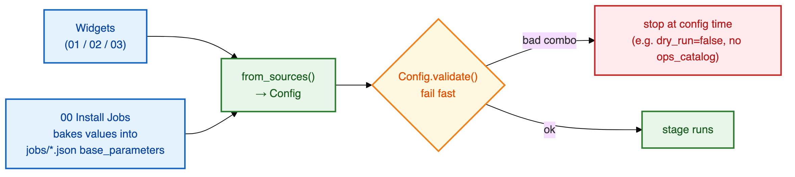
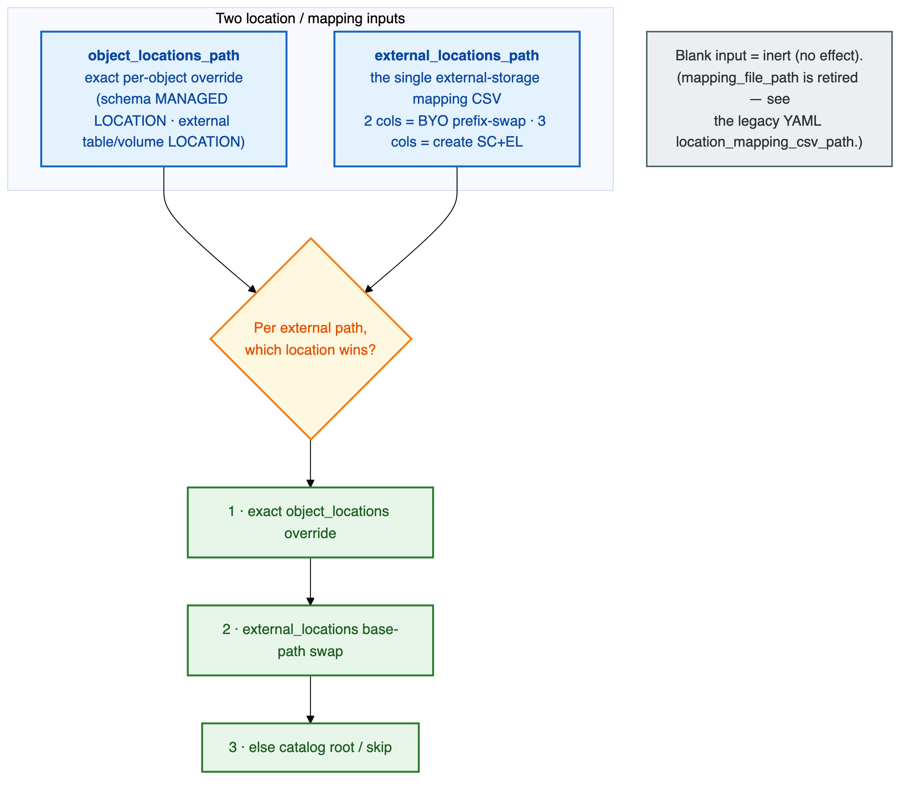

# ⚙️ Configuration Guide

The complete reference for **every widget and configuration option**. All configuration is
**widget-based** — the same values double as **Job parameters** (`base_parameters` in `jobs/*.json`),
which `00_Install_Jobs` bakes in for you.

> 💡 **The service-principal client id is plaintext (it's an identifier, not a secret).** The one
> real secret — the source SP's client secret in remote/direct mode — should come from a **secret
> scope** so it never lands in widget values or job params. It is redacted from artifacts either way.

## 📖 Contents

1. [How configuration flows](#-how-configuration-flows)
2. [Derived values (not widgets)](#-derived-values-not-widgets)
3. [Common widgets (every stage)](#-common-widgets-every-stage)
4. [`01_Inventory` — scope](#-01_inventory--scope)
5. [Source connection (remote source)](#-source-connection-remote-source)
6. [The two location/mapping inputs](#-the-two-locationmapping-inputs)
7. [`03_Import` widgets](#-03_import-widgets)
8. [`00_Install_Jobs` widgets](#-00_install_jobs-widgets)
9. [Mapping file formats](#-mapping-file-formats)
10. [Compute](#-compute)
11. [Quick index of every widget](#-quick-index-of-every-widget)
12. [Worked examples](#-worked-examples)

---

## 🔄 How configuration flows



- **The same value works as a widget and a Job param.** `00_Install_Jobs` projects your values into
  each job's `base_parameters` once, so a scheduled Job needs no manual widget entry.
- **`Config.validate()` fails fast** on a bad combination (e.g. `dry_run=false` with no
  `ops_catalog`/`ops_schema`, or `direct` remote mode with no `source_workspace_url`), so a mistake
  surfaces at config time, not halfway through a migration.

---

## 🧮 Derived values (not widgets)

| Value | How it's derived |
|-------|------------------|
| **`stage`** (`INVENTORY` / `EXPORT` / `IMPORT`) | Set by each notebook — you don't enter it. |
| **State/audit table names** | Tool-owned in `ops_catalog.ops_schema`: `uc_sync_audit`, `uc_sync_state`, `uc_sync_volume_files`. Nothing to typo. |
| **`run_id` chaining** | Inside a Job it chains automatically (`{{job.run_id}}`). For the standalone **Airgap Import** job it is a **job parameter** — set it to the bundle-folder id printed by the source Inventory+Export run. |
| **Bundle path** | `<output_volume_path>/run_<run_id>/…` |

---

## 🌐 Common widgets (every stage)

| Widget | Values | Stage(s) | Description |
|--------|--------|----------|-------------|
| **`connectivity_mode`** | `direct` (default) \| `airgap` | 01, 02 | `direct` = job runs on the target and reads/captures the source over a SQL warehouse; `airgap` = run 01+02 on the source, move the bundle, run 03 on the target. A SQL warehouse is required for export in **both** modes. |
| **`output_volume_path`** | `/Volumes/<c>/<s>/<vol>` | all | Bundle + reports root. Each run reads/writes one location. |
| **`ops_catalog`, `ops_schema`** | names | all | Where the audit/state tables (`uc_sync_audit`, `uc_sync_state`, `uc_sync_volume_files`) are created + written, on the workspace each stage runs on. **Required when `dry_run=false`.** |
| **`run_id`** | string | 02, 03 | Ties Export/Import to the Inventory run. Chains automatically inside a Job; set explicitly for the standalone Airgap Import job. |
| **`source_warehouse_id`** | warehouse id | 01, 02 | **SQL warehouse — REQUIRED for export in every mode (airgap included).** All full-fidelity DDL capture runs on it (`SHOW CREATE`; functions from `information_schema`). A failed capture is a **hard failure** (`DDL_CAPTURE_FAILED`) — no synthesized fallback. Also what stage 01 uses to read tags + ABAC (classic job-cluster Spark cannot read `information_schema.abac_policy_definitions`). Point it at any warehouse on the workspace that owns the objects. |
| **`preflight_enforce`** | bool (default `true`) | all | Graded environment preflight. Enforced → a **NO-GO** (missing report library, unreachable warehouse) is a red run, never a silent degrade. `false` downgrades a NO-GO to a loud warning. |

---

## 🔍 `01_Inventory` — scope

| Widget | Values | Description |
|--------|--------|-------------|
| **`catalogs`** | csv or blank | Scope. Blank = whole metastore. This is the **source** scope — there is no separate "target catalog" input. |
| **`schemas`** | csv `catalog.schema` or blank | Scope within the catalog(s). |

---

## 🔗 Source connection (remote source)

Needed when the source is **not** the current workspace — i.e. a `direct` remote run, or (on `03`)
reading source volume **files** when `copy_volume_data=true`. Blank = read the current workspace.

| Widget | Description |
|--------|-------------|
| **`source_workspace_url`** | The source workspace URL (e.g. `https://adb-....azuredatabricks.net`). |
| **`source_client_id`** | The source SP's `applicationId`. **Not a secret** — always plaintext. |
| **`source_client_secret`** | The SP secret typed directly (**option 1**). ⚠️ Plaintext in widget values / job `base_parameters` — avoid for shared/scheduled jobs. |
| **`source_secret_scope`** + **`source_secret_key`** | The SP secret read from a **secret scope** (**option 2, recommended**) via `dbutils.secrets.get` — never leaves the workspace. |

> **Precedence:** a direct `source_client_secret` wins when both routes are supplied. Either way the
> secret is redacted from artifacts.

---

## 🗺️ The two location/mapping inputs

There are **two** location-related inputs. They are **not duplicates** — each does a distinct job,
and a blank one is **inert (no effect), not unused**. Leaving one out changes where objects land.



| Input | Stage(s) | What it does |
|-------|----------|--------------|
| **`external_locations_path`** | 01, 02, 03 | **The single external-storage mapping CSV** — the primary input. Column shape auto-selects behavior: **2 cols** (`source_base_path,target_base_path`) → BYO (SC/EL are prerequisites; only prefix-swap external `LOCATION`s; SC/EL create toggles forced off); **3 cols** (`+access_connector_id`) → the utility **creates** the storage credential + external location. Drives the export path-rewrite **and** the import-time base-path swap. |
| **`object_locations_path`** | 03 | Optional **exact per-object override** that **BEATS** the base-path swap. A `schema` row sets its `MANAGED LOCATION`; an external volume/table row sets that object's `LOCATION`. Blank = rely on `external_locations` / the catalog root. **Required** for external tables/volumes in existing-catalog mode. |

**Placement precedence** (per external path): **exact `object_locations` override → `external_locations`
base-path swap → catalog root / skip.**

---

## 📥 `03_Import` widgets

### Core

| Widget | Values | Description |
|--------|--------|-------------|
| **`import_warehouse_id`** | warehouse id | **SQL warehouse (target) — REQUIRED for import.** The **entire import replay runs on this one serverless warehouse** — tables, functions, masks / row filters, views, materialized views, ABAC policies, tags, and grants — so there is no classic-Spark DDL path (which is why masked-table `CREATE VIEW` and `CREATE POLICY`, both rejected on classic Spark, work). The import **fails fast** if it's unset. Use a Standard/serverless warehouse (masks/row filters need USER_ISOLATION or serverless). |
| **`dry_run`** | bool (default `false`) | Plan only, no mutations. **Run this first.** When `true`, `ops_catalog`/`ops_schema` are not required. |
| **`catalog_mapping_json`** | JSON or blank | Land a source catalog under a **different target name**, e.g. `{"src":"tgt"}` (identity `{"x":"x"}` is fine). Rewrites the catalog name in every replayed statement (DDL, grants, tags, ABAC, masks); hyphenated names + prefix look-alikes are safe. Does **not** affect storage paths. **If the mapped target catalog already exists, import auto-switches to existing-catalog mode** (skips SC/EL/catalog creation, replicates schemas + objects). |
| **`filter_tables`** | csv or blank | Import only a subset of **tables** (`catalog.schema.table` or bare table). Blank = all. The catalogs/schemas/functions/volumes a selected table needs still come along. |
| **`run_as_spn`** | SP appId or blank | Run the import as a target **service principal** so migrated securables are owned by it. Blank = run as the installing user. |
| **`copy_volume_data`** | bool (default `false`) | Copy volume **file bytes** (not in the bundle) from source to target. Needs the source-connection widgets to read the source. Off = volume *definitions* migrate, contents don't. Recorded in `uc_sync_volume_files`. |
| **`migrate_materialized_views`** | bool (default `false`) | Streaming tables & materialized views are DLT/SDP-managed and **report-only** by default. `true` migrates materialized views; streaming tables are always report-only. |

### Create / apply toggles

| Widget group | Default | Description |
|--------------|---------|-------------|
| **`create_catalogs`, `create_schemas`, `create_storage_credentials`, `create_external_locations`** | **`false`** (BYO) | **BYO-by-default:** the catalog, schemas, storage credential, and external location are customer prerequisites, so their creation is **off by default** — the utility starts *inside the schema*. Turn on for a from-scratch (Mode A) run. A **3-column** `external_locations.csv` turns SC/EL creation back on automatically. When SC/EL creation is off, their grants + ownership are **not** replayed (metastore-scoped, out of a catalog-scoped migration). |
| **`create_volumes`, `create_functions`, `create_tables`, `create_views`, `create_abac_policies`** | `true` | Gate **creation** of schema contents + ABAC. Off = assume pre-existing, skip create, still govern. |
| **`apply_grants`, `apply_tags`, `apply_masks_row_filters`** | `true` | Gate governance application. Note: in the bundle import, **classic masks / row filters ride INLINE in `CREATE TABLE`** (applied atomically, fail-closed), so `apply_masks_row_filters` no longer gates a separate bundle phase (it still gates the direct-mode path). |

> There is **no `force_full` widget** — incremental vs full is auto-detected from `uc_sync_state`
> (baseline present → incremental; none → full + seed). To force a full re-seed, reset the baseline
> (see [Runbook](RUNBOOK.md#-re-running-additive--incremental)).

---

## 🏗️ `00_Install_Jobs` widgets

Runs in the target (or either side, per job). Idempotently deploys the selected `jobs/*.json` and
projects the one-time config into each job's `base_parameters`.

| Widget | Default | Description |
|--------|---------|-------------|
| **`jobs_to_create`** | `End-to-end Dry Run` | Which packaged jobs to create/reset (multiselect). See the [job catalog](#-packaged-jobs). |
| **`job_name_prefix`** | `UC-Gov-Migration` | Prefix for the created job names. |
| **`run_as_spn`** | blank | Target SP the import/e2e jobs run as (own migrated securables). |
| **`source_run_as_spn`** | blank | Source-side (read-only) SP the Airgap Inventory+Export job runs as. |
| **`existing_cluster_id`** | blank | Reuse a cluster instead of a new USER_ISOLATION job cluster. |
| **`spark_version`, `node_type_id`** | env default | Job-cluster shape when a new cluster is created. |
| **`http_proxy`, `https_proxy`** | blank | Proxy URL passthrough for restricted-network workspaces, baked into the job env. **Blank = none** (no proxy). Set to your workspace's proxy URL only if egress requires it. |
| **`no_proxy`** | *(Databricks + Azure storage hosts)* | Bypass list so the Databricks control plane **and** the staging/data-plane storage skip the proxy. Harmless when no proxy URL is set. |
| **`run_now`** | `false` | `true` also triggers the created job immediately. |

Plus every common / import widget (`connectivity_mode`, `output_volume_path`, `ops_*`,
`source_*`, `import_warehouse_id`, the location/mapping inputs, `catalog_mapping_json`,
`filter_tables`, the `create_*`/`apply_*` toggles, …) — all of which it writes into the jobs.

### 📦 Packaged jobs

| Job | Tasks | Runs on | Use it for |
|-----|-------|---------|-----------|
| **Airgap Inventory+Export (source)** | 01 → 02 | source workspace | The **source side** of an `airgap` migration |
| **Airgap Import (target)** | 03 | target workspace | The **target side** of an `airgap` migration (`run_id` = the source bundle id) |
| **End-to-end Dry Run** | 01 → 02 → 03 (`dry_run=true`) | one workspace | The **first** `direct` run — rehearse the whole pipeline |
| **End-to-end Live** | 01 → 02 → 03 (`dry_run=false`) | one workspace | The **live** `direct` run, after the dry run reads clean |

---

## 🗂️ Mapping file formats

### `external_locations.csv` — the single external-storage mapping

**3-column (create mode)** — the utility creates the storage credential + external location:

```csv
source_base_path,target_base_path,access_connector_id
abfss://uc@src.dfs.core.windows.net,abfss://uc@tgt.dfs.core.windows.net,/subscriptions/…/accessConnectors/tgt-connector
```

**2-column (BYO mode)** — SC/EL are prerequisites; only prefix-swap external `LOCATION`s (SC/EL create
toggles forced off):

```csv
source_base_path,target_base_path
abfss://uc@src.dfs.core.windows.net,abfss://uc@tgt.dfs.core.windows.net
```

- `source_base_path → target_base_path` — **longest-prefix match** rewrites every derived ADLS path
  (catalog/schema managed roots, external-location URLs, external-table + external-volume paths).
- `access_connector_id` — resolved **per credential** from the row matching that credential's source
  storage location, so an enterprise layout with **one connector per catalog** works (give each row
  its own connector; a single shared connector across rows also works — repeat the id).

### `object_locations.csv` — exact per-object override (`object_locations_path`)

```csv
schema,volume,table,location
crm,,,abfss://data@acct.dfs.core.windows.net/crm            # schema MANAGED LOCATION
orders,archive,,abfss://data@acct.dfs.core.windows.net/orders/archive   # external VOLUME
sales,,raw_events,abfss://data@acct.dfs.core.windows.net/raw_events     # external TABLE
```

- `schema` + `location` → the schema's `MANAGED LOCATION` (not listed → schema at the catalog root).
- `schema` + `volume` + `location` → that external volume's `LOCATION`.
- `schema` + `table` + `location` → that external table's `LOCATION`.
- Names are **source** names (only the catalog is remapped on import). Every location must be covered
  by an **existing** external location on target, or the import reports `EXTERNAL_LOCATION_MISSING`.
- In **existing-catalog mode**, an external table/volume with **no** row here cannot be placed and is
  reported `EXTERNAL_LOCATION_MISSING` (managed objects are unaffected).

---

## 🖥️ Compute

Masks and row filters require **Standard (USER_ISOLATION)** or **serverless** compute — never
single-user/assigned clusters (they reject
`ROW_COLUMN_ACCESS_POLICIES_NOT_SUPPORTED_ON_ASSIGNED_CLUSTERS`). New jobs get a USER_ISOLATION job
cluster by default; set `existing_cluster_id` to reuse one.

---

## 🗃️ Quick index of every widget

<details>
<summary><b>Click to expand — alphabetical index</b></summary>

| Widget | Stage(s) | Default |
|--------|----------|---------|
| `apply_grants` / `apply_tags` / `apply_masks_row_filters` | import | `true` |
| `catalog_mapping_json` | import | `""` |
| `catalogs` | inventory | `""` (whole metastore) |
| `connectivity_mode` | 01, 02, install | `direct` |
| `copy_volume_data` | import | `false` |
| `create_catalogs` / `create_schemas` / `create_storage_credentials` / `create_external_locations` | import | **`false`** (BYO) |
| `create_volumes` / `create_functions` / `create_tables` / `create_views` / `create_abac_policies` | import | `true` |
| `dry_run` | import | `false` |
| `existing_cluster_id` | install | `""` |
| `external_locations_path` | 01, 02, 03 | `""` |
| `filter_tables` | import | `""` |
| `http_proxy` / `https_proxy` | install | `""` (blank = no proxy) |
| `import_warehouse_id` | import | *(required for import)* |
| `job_name_prefix` | install | `UC-Gov-Migration` |
| `jobs_to_create` | install | `End-to-end Dry Run` |
| `migrate_materialized_views` | import | `false` |
| `no_proxy` | install | *(Databricks + Azure storage hosts)* |
| `node_type_id` / `spark_version` | install | env default |
| `object_locations_path` | import | `""` |
| `ops_catalog` / `ops_schema` | all | `""` (required live) |
| `output_volume_path` | all | *(required)* |
| `preflight_enforce` | all | `true` |
| `run_as_spn` | import, install | `""` |
| `run_id` | 02, 03 | *(auto / chained)* |
| `run_now` | install | `false` |
| `schemas` | inventory | `""` (all) |
| `source_client_id` | source-read | `""` |
| `source_client_secret` | source-read | `""` (option 1) |
| `source_run_as_spn` | 01+02, install | `""` |
| `source_secret_scope` / `source_secret_key` | source-read | `""` (option 2, preferred) |
| `source_warehouse_id` | 01, 02 | *(required for export)* |
| `source_workspace_url` | source-read | `""` (blank = current ws) |

</details>

---

## 🧪 Worked examples

### Example 1 — Airgap, from scratch (Mode A), first dry run

```
# SOURCE side (Airgap Inventory+Export job):
connectivity_mode        = airgap
catalogs                 = sales_prod          # blank = whole metastore
schemas                  =                     # blank = all schemas in scope
source_warehouse_id      = <source SQL warehouse>       # REQUIRED for export
output_volume_path       = /Volumes/<src>/ops/mig/out   # bundle lands here (location A)
ops_catalog              = <source ops catalog>         # audit/state on the source ws
ops_schema               = <source ops schema>
```

```
# TARGET side (Airgap Import job), after copying run_<id>/ to the target volume (location B):
connectivity_mode        = airgap
run_id                   = <source bundle id>            # the run_<id> from the source run
output_volume_path       = /Volumes/<tgt>/ops/mig/out    # target path holding the moved run_<id>/
ops_catalog              = <target ops catalog>          # required (dry_run writes state too)
ops_schema               = <target ops schema>
import_warehouse_id      = <target SQL warehouse>        # REQUIRED for import
external_locations_path  = /Volumes/<tgt>/ops/mig/external_locations.csv   # 3-col → create SC+EL
create_catalogs          = true
create_schemas           = true
create_storage_credentials = true
create_external_locations  = true
dry_run                  = true                          # rehearse first
```

### Example 2 — Direct end-to-end, live, into an existing catalog (Mode B / BYO)

```
connectivity_mode        = direct
catalogs                 = src_cat                       # inventory scope
source_workspace_url     = https://adb-<source>.azuredatabricks.net
source_client_id         = <source read SP appId>
source_secret_scope      = uc_sync
source_secret_key        = source_sp_secret
source_warehouse_id      = <source SQL warehouse>        # REQUIRED for export
import_warehouse_id      = <target SQL warehouse>        # REQUIRED for import
output_volume_path       = /Volumes/<tgt>/ops/mig/out    # bundle + reports root
ops_catalog              = <target ops catalog>          # REQUIRED when live
ops_schema               = <target ops schema>
catalog_mapping_json     = {"src_cat":"existing_tgt_cat"}   # auto existing-catalog mode
object_locations_path    = /Volumes/<tgt>/ops/mig/object_locations.csv   # required for external objects
dry_run                  = false
# create_* SC/EL/catalog left false (BYO prerequisites)
```

### Example 3 — Rename the catalog on the target

```
# Add to a full config (e.g. Example 2's base):
catalog_mapping_json     = {"source_catalog":"target_catalog"}
# Inventory/Export still use the source name; the rename happens on import.
# Storage paths still come from external_locations.csv — the rename doesn't touch them.
```

### Example 4 — Re-run to pick up new objects/grants/tags (incremental)

```
# Re-run the same stages with the same widgets. Incremental is auto-detected from uc_sync_state:
# new → created, changed → updated, unchanged → skipped, removed → reported (never applied).
```

---

## 📚 Next

- 📋 Put it together, step by step → **[Runbook](RUNBOOK.md)**
- 🔐 What access these SPs need → **[Permissions Guide](PERMISSIONS_GUIDE.md)**
- 🏗️ Why it's shaped this way → **[Architecture](ARCHITECTURE.md)**
