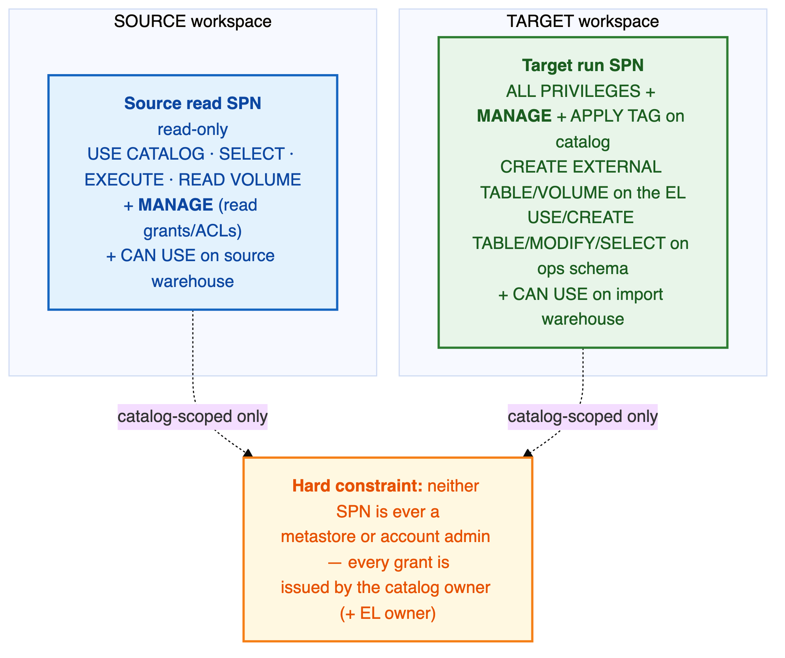

# 🔐 Permissions Guide

The minimal, **catalog-scoped** privileges the two service principals need. Every requirement here is
stated as the asserted minimum and can be **verified live** with `testing/permission_probe.py`, run
**as the candidate SP**.

> ## 🚫 Hard constraint — no metastore/account admin, ever
>
> **Neither service principal is ever a metastore or account admin.** Every grant below is
> issued by the **catalog owner** (and, for external placement, the **external-location owner**).
> This is a non-negotiable constraint of the target environment, and the whole permission model is
> built around it.

> ## ✅ TL;DR — the minimum
>
> | Identity | Where | Minimum access |
> |----------|-------|----------------|
> | **Source read SP** | Source catalog | `USE CATALOG`, `USE SCHEMA`, `SELECT`, `EXECUTE`, `READ VOLUME` **+ `MANAGE`** (reads ACLs) + `CAN USE` on the source SQL warehouse |
> | **Target run SP** | Target catalog | `ALL PRIVILEGES` **+ `MANAGE`** **+ `APPLY TAG`** + `CREATE EXTERNAL TABLE/VOLUME` on the EL + ops-schema grants + `CAN USE` on the import warehouse |
>
> `MANAGE` is the key privilege and is **not** part of `ALL PRIVILEGES` — grant it explicitly.

## 📖 Contents

1. [The identities involved](#-the-identities-involved)
2. [Source read SP (Inventory + Export)](#-source-read-sp-inventory--export)
3. [Target run SP (Import)](#-target-run-sp-import)
4. [Why these specific privileges](#-why-these-specific-privileges)
5. [External locations & storage credentials](#-external-locations--storage-credentials)
6. [`information_schema` scope — verify live](#-information_schema-scope--verify-live)
7. [Manual prerequisites the tool will never do](#-manual-prerequisites-the-tool-will-never-do)
8. [Troubleshooting: symptom → cause → fix](#-troubleshooting-symptom--cause--fix)
9. [Setup checklist](#-setup-checklist)
10. [Verify it live — the permission probe](#-verify-it-live--the-permission-probe)

---

## 👤 The identities involved



| SP | Runs | On |
|----|------|-----|
| **Source read SP** | `01_Inventory` → `02_Export` (read-only) | source workspace |
| **Target run SP** | `03_Import` (creates objects + applies governance) | target workspace |

In `airgap` these run on their own sides and never talk. In `direct` the source read SP's credential
is supplied to the target so it can read the source over REST.

---

## 1️⃣ Source read SP (Inventory + Export)

Enumerates objects, captures `SHOW CREATE` DDL over a SQL warehouse, reads function bodies / tags /
ABAC from each catalog's own `information_schema`, and reads grants via the UC permissions API.

```sql
-- Preferred (least-privilege, read-only): omit CREATE/MODIFY.
GRANT USE CATALOG, USE SCHEMA, SELECT, EXECUTE, READ VOLUME ON CATALOG <src> TO `<src_spn>`;
GRANT MANAGE ON CATALOG <src> TO `<src_spn>`;   -- REQUIRED to read grants/ACLs
-- + CAN USE on the source SQL warehouse (SHOW CREATE + information_schema run there).

-- Simpler equivalent, if the client prefers: ALL PRIVILEGES + MANAGE ON CATALOG <src>.
```

The source SP is read-only, so the tighter set (no `CREATE`/`MODIFY`) is preferred; `MANAGE` is the
one non-negotiable addition (nothing weaker reads ACLs).

---

## 2️⃣ Target run SP (Import)

Runs `03_Import`. In the default **BYO** posture the catalog and schemas are **pre-created by the
customer**; the SP fills in contents + governance.

```sql
GRANT ALL PRIVILEGES ON CATALOG <tgt> TO `<tgt_spn>`;   -- create tables/views/functions/volumes
GRANT MANAGE         ON CATALOG <tgt> TO `<tgt_spn>`;   -- apply grants + policies (catalog/schema + created objects)
GRANT APPLY TAG      ON CATALOG <tgt> TO `<tgt_spn>`;   -- apply governed tags

-- External placement (only when the bundle has external tables/volumes), issued by the EL owner:
GRANT CREATE EXTERNAL TABLE, CREATE EXTERNAL VOLUME ON EXTERNAL LOCATION <el> TO `<tgt_spn>`;

-- Ops state tables (uc_sync_audit / uc_sync_state / uc_sync_volume_files):
GRANT USE CATALOG, USE SCHEMA, CREATE TABLE, MODIFY, SELECT ON SCHEMA <ops>.<schema> TO `<tgt_spn>`;
-- + CAN USE on the import/target SQL warehouse (the ENTIRE import replay runs on it — required).
```

The **standing (incremental) set is identical** — re-runs need nothing extra. If the client prefers
tighter than `ALL PRIVILEGES`, use the explicit `CREATE TABLE, CREATE FUNCTION, CREATE VOLUME`
(+ `CREATE SCHEMA` if ever needed) + `MANAGE` + `APPLY TAG`.

> When SC/EL/catalog **creation** is on (Mode A / a 3-column `external_locations.csv`), the SP that
> creates them needs the corresponding metastore-level create right on those securables, granted by
> their owner — still not metastore admin.

---

## 3️⃣ Why these specific privileges

- **`MANAGE` is the key privilege and is NOT part of `ALL PRIVILEGES`** — grant it explicitly.
  Reading **all** grants on a securable requires the owner, the parent's owner, `MANAGE`, or metastore
  admin — plain `SELECT` shows only your own grants. `MANAGE` on the catalog **cascades** to its
  schemas/tables, so it covers reading (source) and applying (target) grants **and** policies across
  everything under the catalog.
- **`ALL PRIVILEGES` (cascaded from the catalog)** covers `USE CATALOG` / `USE SCHEMA` / `SELECT` /
  `EXECUTE` / `READ VOLUME` (source reads) and, on target, `CREATE TABLE/VIEW/FUNCTION/VOLUME`.

### The utility never touches the run-as SP's own grants

When replicating source ACLs onto the target, the utility **excludes the run-as SP as a grantee** (it
already holds catalog-scoped `ALL PRIVILEGES + MANAGE`). No residual-grant reconciliation, no revokes,
no ownership gymnastics for the SP.

---

## 🗄️ External locations & storage credentials

ELs/SCs are **metastore-level** securables, not under the catalog, so catalog-scoped grants don't
reach them. The utility deliberately **does not require the source SP to read source ELs/SCs**:
external paths come from each object's own DDL `LOCATION` (covered by `SELECT` / `ALL PRIVILEGES`) and
are re-pointed by the operator-supplied `external_locations.csv`. On target, placing an external
object into a pre-created EL needs `CREATE EXTERNAL TABLE` / `CREATE EXTERNAL VOLUME` **on that EL**,
granted by the **EL owner** — again no metastore admin.

> **Report note (expected, not a bug):** because catalog-scoped grants don't reach metastore-level
> SC/EL, the **Storage Credentials / External Locations sheets may be empty** in a catalog-scoped
> run. Source SC/EL discovery is best-effort (empty if the SP lacks a privilege, never a failure). In
> 3-column `external_locations.csv` **create** mode the utility still creates + reports SC/EL; in
> 2-column BYO / Mode B they are customer prerequisites, so empty/skip is correct.

---

## 🔎 `information_schema` scope — verify live

Databricks docs: the per-catalog `<catalog>.information_schema` needs only `USE CATALOG` +
`SELECT`/`BROWSE` (covered above), **not** the `system` catalog. Some environments have been observed
to require central `system.information_schema` access. **Don't assume — the permission probe proves
it.** If `system` reads turn out to be needed, that is a `SELECT` grant on the `system` schema issued
by whoever owns `system`; it does **not** make the SP a metastore admin:

```sql
GRANT USE CATALOG ON CATALOG system TO `<src_spn>`;
GRANT USE SCHEMA ON SCHEMA system.information_schema TO `<src_spn>`;
GRANT SELECT ON <the needed system.information_schema views> TO `<src_spn>`;
```

---

## 🚫 Manual prerequisites the tool will never do

These need privileges or steps outside a catalog-scoped SP's reach. The tool **reports them as clean
manual actions** rather than failing or guessing.

| Manual prerequisite | Why | What to do |
|---------------------|-----|------------|
| **Governed-tag definitions** *(conditional)* | The tool **recreates** them itself in Phase 0 (`CREATE GOVERNED TAG`, idempotent) from the source's captured definitions. But governed tags are **account-scoped**, so creating one may need a privilege beyond the catalog-scoped `APPLY TAG` — and reading the source's definitions needs the source SP to reach `/api/2.1/tag-policies`. | If either can't happen, define the tag on the target account first (workspace-migration utility / `POST /api/2.1/tag-policies`), else `SET TAGS` reports `GOVERNANCE_PREREQ_MISSING`. |
| **Target metastore + storage + access connector** | Azure + account-admin work | Create the target metastore, ADLS container, and a Databricks access connector with `Storage Blob Data Contributor`; hand over the connector id + path mapping. |
| **Storage-credential secrets (non-MI)** | Secrets are never exported | Recreate the credential by hand; the utility emits `MANUAL_ACTION_REQUIRED` with the DDL retained for review. |
| **Identities (users / groups / SPs)** | Owned by the workspace-migration utility | Ensure principals exist on the target before grants replay. |
| **Connections / Delta shares / recipients / providers** | Carry remote secrets/endpoints | Recreate by hand and re-point consumers (inventory-only, flagged `MANUAL`). |

---

## 🔧 Troubleshooting: symptom → cause → fix

| Symptom | Likely cause | Fix |
|---------|-------------|-----|
| **`GOVERNANCE_PREREQ_MISSING`** on tags/ABAC | The Phase-0 governed-tag recreate didn't cover it (couldn't read the source definition, or `CREATE GOVERNED TAG` lacked account-level privilege), or a referenced mask/filter **function** is missing | Define the tag on the target account (workspace-migration utility); ensure functions imported (`create_functions=true`). |
| **ABAC Policies / Policy-Matched-Columns sheets empty** (tags populate fine) | `source_warehouse_id` unset — classic job-cluster Spark can't read `abac_policy_definitions` | Set `source_warehouse_id` to a SQL warehouse (required in airgap too). |
| **`CREATE MANAGED STORAGE` denied on catalog create**, then `NO_SUCH_CATALOG` cascade | An older build transferred ownership before creating the catalog, stripping the run principal's `CREATE MANAGED STORAGE` | **Fixed** — ownership is now deferred to a final phase. On an old build, grant it back and re-run. |
| **`PERMISSION_DENIED: … CREATE SCHEMA on Catalog`** (existing-catalog mode) | The run SP doesn't own the pre-existing catalog and lacks `CREATE SCHEMA` | `GRANT USE CATALOG, CREATE SCHEMA ON CATALOG <cat> TO \`<spn>\`` as the owner (or run as the owner). |
| **`EXTERNAL_LOCATION_MISSING`** on an external table/volume/schema | Its target `LOCATION` has no covering external location, or no `object_locations_path` row (existing-catalog mode) | Add an `object_locations.csv` row whose path is covered by an **existing** EL; grant `CREATE EXTERNAL …` on that EL. |
| **`NO_SUCH_STORAGE_CREDENTIAL_EXCEPTION`** on external location | Source-named credential absent on target | Provide it in the mapping, or if the target EL already covers the path set `create_storage_credentials=false` + `create_external_locations=false`. |
| **`ROW_COLUMN_ACCESS_POLICIES_NOT_SUPPORTED_ON_ASSIGNED_CLUSTERS`** | Masks/row filters on a single-user cluster | Use Standard (USER_ISOLATION) or serverless compute. |
| **Storage credential shows `MANUAL_ACTION_REQUIRED`** | Secrets are never exported | Recreate the credential by hand. |

---

## 🧰 Setup checklist

**Source read SP** — on the source catalog: `USE CATALOG`, `USE SCHEMA`, `SELECT`, `EXECUTE`,
`READ VOLUME`, **`MANAGE`**; `CAN USE` on a source SQL warehouse.

**Target run SP** — on the pre-created target catalog + ops schema: `ALL PRIVILEGES`, **`MANAGE`**,
**`APPLY TAG`** on the catalog; `USE CATALOG`/`USE SCHEMA`/`CREATE TABLE`/`MODIFY`/`SELECT` on the ops
schema; `CREATE EXTERNAL TABLE`/`CREATE EXTERNAL VOLUME` on the EL (external objects only); `CAN USE`
on a target SQL warehouse.

**Prerequisites (before import):** target metastore + storage + access connector; identities present
on target. *(Governed-tag definitions are recreated by the tool in Phase 0 — pre-provision them only
as the conditional fallback above.)*

---

## 🧪 Verify it live — the permission probe

Run **as the candidate SP** (a CLI profile authenticated as that SP, not an admin):

```bash
# Source read SP:
python3 testing/permission_probe.py --side source \
    --profile <spn_profile> --warehouse-id <src_wh> --catalog <src_catalog> \
    --emit-guide docs/PERMISSIONS_GUIDE.md

# Target run SP (writes to a scratch table in a pre-created schema, then drops it):
python3 testing/permission_probe.py --side target \
    --profile <spn_profile> --warehouse-id <tgt_wh> --catalog <tgt_catalog> \
    --schema <pre_created_schema> --emit-guide docs/PERMISSIONS_GUIDE.md
```

Each operation the utility performs is exercised and recorded PASS/FAIL with the exact grant that
unblocks it. Remove one grant, re-run, and the probe shows exactly which operation breaks — proving
minimality.

---

## 📚 Next

- 📋 Put access to work → **[Runbook](RUNBOOK.md)**
- ⚙️ Which widget carries which credential → **[Configuration Guide](CONFIGURATION_GUIDE.md#-source-connection-remote-source)**
- 🏗️ Why it's shaped this way → **[Architecture](ARCHITECTURE.md)**
