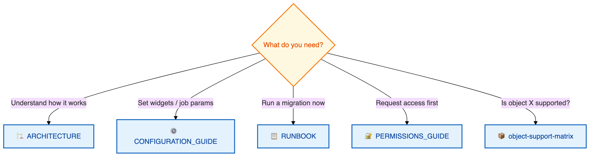
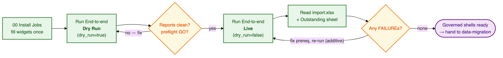

# 📚 UC Governance Migration Utility — Documentation

Config-driven, notebook-based migration of **Unity Catalog structure + governance** (no table data)
from a **source** metastore to a **target** metastore (Azure region → region).

---

## 🧭 Documentation index

| # | Document | Description | Audience |
|---|----------|-------------|----------|
| 1 | **[README.md](README.md)** | This index / hub (you are here) | Everyone |
| 2 | **[ARCHITECTURE.md](ARCHITECTURE.md)** | Working model, `direct` vs `airgap`, the bundle, dependency order, fail-closed governance, scope | Everyone — read first |
| 3 | **[CONFIGURATION_GUIDE.md](CONFIGURATION_GUIDE.md)** | Every widget & config option, grouped by stage, with defaults + examples | Operators, DevOps |
| 4 | **[RUNBOOK.md](RUNBOOK.md)** | Scenario-by-scenario operator instructions for both modes | Operators |
| 5 | **[PERMISSIONS_GUIDE.md](PERMISSIONS_GUIDE.md)** | The catalog-scoped, no-metastore-admin grants each SP needs | Operators, customer IT / admins |
| 6 | **[object-support-matrix.md](object-support-matrix.md)** | Per-object: created? governed? notes | Everyone — reference |

---

## 🚦 Pick your path

---

## Overview

The utility runs as **four thin notebooks** backed by an importable `src/uc_sync/` package:

| Notebook | Stage | Purpose |
|----------|-------|---------|
| `00_Install_Jobs` | — | Idempotent installer that stamps your widgets into `jobs/*.json` and creates the Databricks Jobs |
| `01_Inventory` | inventory | **Read-only** enumeration + governed-tag / ABAC / grant capture → `bundle/inventory.json` |
| `02_Export` | export | Full-fidelity `SHOW CREATE` DDL **over a SQL warehouse** → the bundle, then path-rewrite to `migrated/` |
| `03_Import` | import | Replay `migrated/` on the target in **dependency order** — governed, **fail-closed**, idempotent |

Two modes decide **who reads the source** and **whether the bundle hop is manual**:

- **`direct`** (default): `03` runs in the target; `01`/`02` read the source over REST and capture DDL
  over the **source** SQL warehouse — the whole migration can be **one Job**, no manual hop.
- **`airgap`**: `01`/`02` run *inside* the source (capture over a source warehouse) and write a bundle;
  ops **physically moves** the `run_<id>/` directory to the target; `03` runs *inside* the target.

Both modes emit the **same bundle**, so import is mode-agnostic.

> ⚠️ **SQL warehouses are required.** Export runs on `source_warehouse_id` in *both* modes; the
> **entire import replay** runs on a single serverless `import_warehouse_id` (required — the import
> fails fast without it).

---

## 🧱 Key concepts at a glance

| Concept                             | What it means |
|-------------------------------------|---------------|
| **Bundle**                          | A run-isolated, self-describing `run_<id>/` directory (`export/` + `migrated/` + `reports/` + `manifest.json` + `checksums/`). In `airgap` it is the only thing that crosses between workspaces. |
| **Names are never mapped**          | Every securable is recreated under its **source name** (a region move uses two metastores, so no collision). Only **storage paths** are rewritten; only the **catalog** can be renamed, via `catalog_mapping_json`. |
| **Warehouse-only capture**          | Full-fidelity DDL comes from `SHOW CREATE` on a SQL warehouse. A failed capture is a **hard failure** — never a metadata-synthesized fallback that would silently drop masks/constraints. |
| **Fail-closed governance**          | A governed table that can't be fully protected **never survives**: inline masks fail the `CREATE` atomically; a tag/ABAC failure drops the fresh table (`PROTECTION_FAILED`). |
| **Additive & incremental**          | Auto-detected from `uc_sync_state`: create the new, update the changed, skip the unchanged (zero writes); **removals are reported, never applied**. |
| **BYO (Bring your own)-by-default** | Catalog / schema / storage-credential / external-location creation is **off by default** (customer prerequisites); the utility starts *inside the schema*. |
| **Catalog-scoped, no admin**        | Neither service principal is ever a metastore or account admin — every grant is catalog-scoped and issued by the catalog (and EL) owner. |

Full detail in **[ARCHITECTURE.md](ARCHITECTURE.md)**.

---

## 🗺️ The happy path

Every step, with exact widget values, is in the **[Runbook](RUNBOOK.md)**.

---

## 🏷️ Versioning & changelog

The utility follows [Semantic Versioning](https://semver.org/) (`MAJOR.MINOR.PATCH`). The number
lives in one place — the root [`VERSION`](../VERSION) file — read by `src/uc_sync/__init__.py` and
stamped into every bundle's `manifest.json`, `uc_sync_audit`, and `uc_sync_state`, so each artifact
records exactly which build produced it.

- **PATCH** (`1.0.0 → 1.0.1`) — backward-compatible fixes (a corrected capture, a fixed report label).
- **MINOR** (`1.0.0 → 1.1.0`) — backward-compatible additions (a new object type, a new widget/option).
- **MAJOR** (`1.0.0 → 2.0.0`) — breaking changes (bundle-format or state-schema change, removed/renamed
  widgets, a changed default that needs operator action).

Record every change in the root **[CHANGELOG.md](../CHANGELOG.md)** (accumulate under *Unreleased*,
then rename to the new version + date at release and bump `VERSION`).
