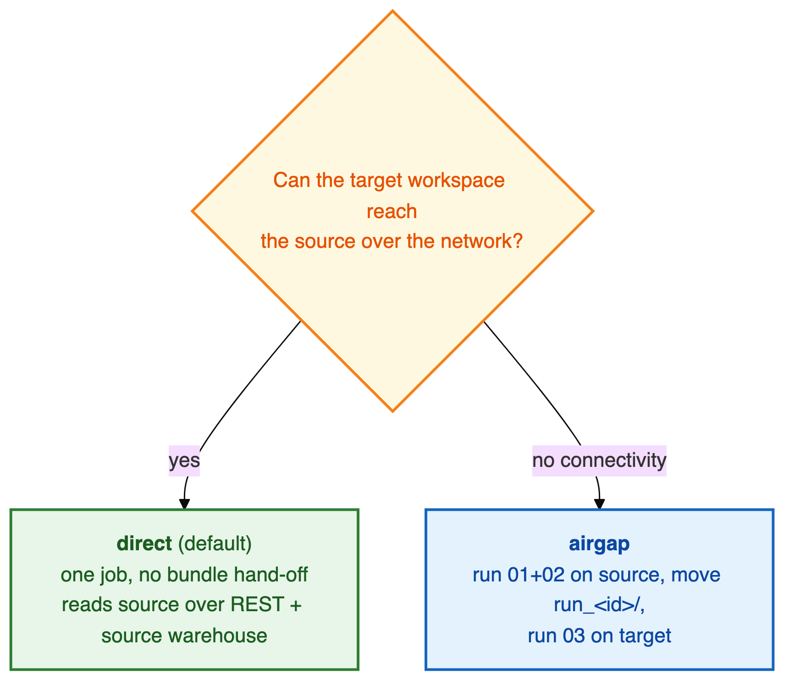
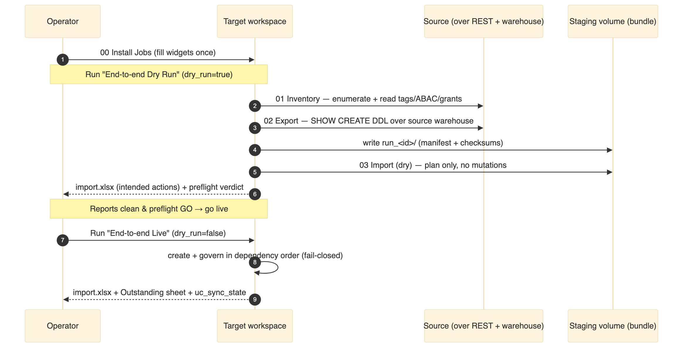
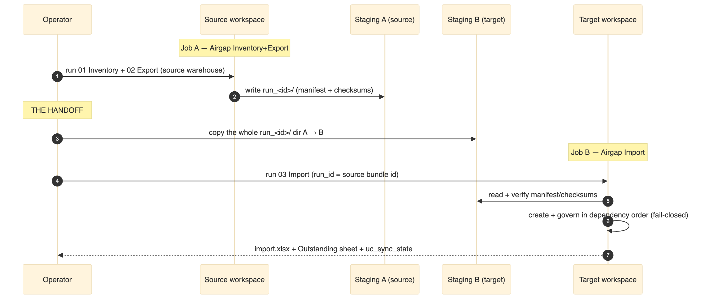
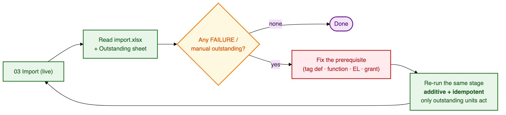

# 📋 Runbook

The step-by-step guide to running a real migration of **UC structure + governance** (no table data)
from a source metastore to a target metastore. Every step names the **exact widget values** to set
and **what you should see** before moving on.

> 🧭 **First time?** Read the [Architecture overview](ARCHITECTURE.md#-the-big-picture) (5 min) and
> confirm access with the [Permissions Guide](PERMISSIONS_GUIDE.md). Then start here.

## 📖 Contents

1. [Before you begin — prerequisites](#-before-you-begin--prerequisites)
2. [Install the jobs (one time)](#-install-the-jobs-one-time)
3. [Choose your mode](#-choose-your-mode)
4. [Path A — `direct` mode (recommended)](#-path-a--direct-mode-recommended)
5. [Path B — `airgap` mode](#-path-b--airgap-mode)
6. [Scenario cookbook](#-scenario-cookbook)
7. [Reading the outputs](#-reading-the-outputs)
8. [Handling failures & manual actions](#-handling-failures--manual-actions)
9. [Re-running (additive & incremental)](#-re-running-additive--incremental)
10. [Quick reference card](#-quick-reference-card)

---

## ✅ Before you begin — prerequisites

Tick every box before your first run. Details are in the [Permissions Guide](PERMISSIONS_GUIDE.md)
and the manual-prerequisites table there.

| ☐ | Prerequisite | How to satisfy |
|---|--------------|----------------|
| ☐ | **Target metastore + storage + access connector** exist | Create the metastore, an ADLS container, and a Databricks access connector with `Storage Blob Data Contributor`; note the connector id |
| ☐ | **Governed-tag definitions** — usually automatic | The tool **recreates** the source's captured definitions on the target in Phase 0 (`CREATE GOVERNED TAG`, idempotent). Ensure they exist on the target account (workspace-migration utility / Tag Policy API) **only** if the source can't be read or the target SP can't create them — else `SET TAGS` reports `GOVERNANCE_PREREQ_MISSING` |
| ☐ | **Identities** (users / groups / SPs) present on target | The workspace-migration utility runs first |
| ☐ | **Source read SP** is catalog-scoped incl. `MANAGE` + `CAN USE` on a **source SQL warehouse** | [Permissions › source SP](PERMISSIONS_GUIDE.md#1️⃣-source-read-sp-inventory--export) |
| ☐ | **Target run SP** has `ALL PRIVILEGES + MANAGE + APPLY TAG` on the (pre-created) catalog + ops-schema grants + `CAN USE` on a **target SQL warehouse** | [Permissions › target SP](PERMISSIONS_GUIDE.md#2️⃣-target-run-sp-import) |
| ☐ | **A source SQL warehouse** (`source_warehouse_id`) and a **target SQL warehouse** (`import_warehouse_id`) | Export requires the source warehouse in both modes; the **entire import** runs on the target warehouse — it's required, and the import fails fast without it |
| ☐ | **Compute is Standard (USER_ISOLATION) or serverless** | Masks / row filters are rejected on single-user clusters |

> ⚠️ **Do the dry run first, always.** Run the End-to-end **Dry Run** job (or `03_Import` with
> `dry_run=true`) — a full rehearsal that writes nothing — and read the reports before going live.

> 🌐 **Restricted-network workspaces:** run on an all-purpose (classic) USER_ISOLATION cluster in the
> workspace's own network, and set `http_proxy` / `https_proxy` / `no_proxy` at install so Databricks
> **and** the staging Volume storage bypass the proxy. The notebooks pull `databricks-sdk`,
> `openpyxl`, `PyYAML` — pre-install them as cluster libraries if `%pip` / PyPI is blocked (`openpyxl`
> is the one most often missing, and the graded preflight will NO-GO without it).

---

## 🏗️ Install the jobs (one time)

The utility is four notebooks: **`00_Install_Jobs`** (the wrapper) plus **`01_Inventory` /
`02_Export` / `03_Import`**. You don't wire tasks by hand — open `00_Install_Jobs`, fill the widgets
once, pick the jobs in `jobs_to_create`, and run. It stamps your values into `jobs/*.json` and
creates (or updates in place, by name) the selected Databricks Jobs.

| Job | Tasks | Runs on |
|---|---|---|
| **Airgap Inventory+Export (source)** | 01 → 02 | source workspace |
| **Airgap Import (target)** | 03 | target workspace |
| **End-to-end Dry Run** | 01 → 02 → 03 (`dry_run=true`) | one workspace |
| **End-to-end Live** | 01 → 02 → 03 (`dry_run=false`) | one workspace |

`run_id` chains automatically inside a job run (`{{job.run_id}}`); for the standalone **Airgap Import**
job it's a **job parameter** set at run time. New jobs get a USER_ISOLATION job cluster; set
`existing_cluster_id` to reuse one. You can also run the three stage notebooks directly.

---

## 🔀 Choose your mode



| If… | Use | Why |
|-----|-----|-----|
| The target **can reach** the source over the network | **`direct`** *(default)* | One end-to-end Job, no manual bundle hop |
| There is **no connectivity** between source and target | **`airgap`** | Two sides + a manual bundle handoff |

---

## 🟢 Path A — `direct` mode (recommended)

Everything runs in the **target**; `01`/`02` read the source over REST + the source SQL warehouse.



### Step 1 · Install the jobs

Open `00_Install_Jobs` and set `jobs_to_create = End-to-end Dry Run, End-to-end Live`,
`connectivity_mode=direct`, `source_workspace_url` + `source_client_id` +
`source_secret_scope`/`source_secret_key`, `source_warehouse_id`, `import_warehouse_id`,
`output_volume_path`, `ops_catalog`/`ops_schema`, the [location/mapping inputs](CONFIGURATION_GUIDE.md#-the-two-locationmapping-inputs),
and `run_as_spn`. **Run it.** ✅ *Expected:* the two jobs appear under **Jobs & Pipelines** with your
config baked into their parameters.

### Step 2 · Run the dry run

Run **End-to-end Dry Run** (`01 → 02 → 03` with `dry_run=true`). ✅ *Expected:* the job succeeds, the
import task **writes nothing**, and `reports/import.xlsx` + a preflight verdict are produced.

### Step 3 · Read the dry-run reports

Open the bundle at `<output_volume_path>/run_<run_id>/`:

1. **Preflight verdict** — must be **GO**. Fix any 🔴 NO-GO first.
2. **`reports/import.xlsx`** — one sheet per object type showing the **intended action**
   (create / update / skip / manual) for every object. Scan for surprises.

> 🚦 **Gate:** proceed only when preflight is **GO** and the intended actions look right.

### Step 4 · Run the live migration

Run **End-to-end Live** (identical, `dry_run=false`). ✅ *Expected:* objects are created + governed in
dependency order, fail-closed; `reports/import.xlsx` + the **Outstanding** sheet + `uc_sync_state` are
written.

### Step 5 · Review & finish

Work through [Reading the outputs](#-reading-the-outputs) and
[Handling failures](#-handling-failures--manual-actions). Then hand the governed shells to the
data-migration utility.

---

## 🔵 Path B — `airgap` mode

Two sides that never connect. A human moves the bundle between them.



### On the SOURCE side

**Step 1 · Pull the repo into the source workspace** as a Git folder.

**Step 2 · Install + run the source job.** In `00_Install_Jobs` set
`jobs_to_create = Airgap Inventory+Export`, `connectivity_mode=airgap`, `catalogs` (± `schemas`),
`source_warehouse_id` (**a source SQL warehouse — required**), `output_volume_path` (bundle lands
here), `ops_catalog`/`ops_schema`. Leave the `source_workspace_url`/SP creds blank (the job runs *on*
the source → local auth). Run the **Airgap Inventory+Export** job (`01 → 02`).

✅ *Expected:* a complete bundle at `<output_volume_path>/run_<run_id>/` with `manifest.json` +
`checksums/`. Note the `run_id`.

### The HANDOFF

**Step 3 · Move the bundle.** Copy the whole `run_<run_id>/` directory from the source volume to the
target-readable volume, preserving structure. Verify `manifest.json` + `checksums/` arrived.

> ⚠️ Move the **whole** run directory. The target verifies counts + checksums against the manifest
> before it acts — an incomplete upload is caught, never mistaken for a complete migration.

### On the TARGET side

**Step 4 · Import (dry run).** Pull the repo into the target. Install/run the **Airgap Import** job (or
`03_Import`) with `connectivity_mode=airgap`, `run_id = <the source run_id>`, `output_volume_path` =
the target path holding the moved bundle, `import_warehouse_id` (**required** — the whole import runs
on it), `ops_catalog`/`ops_schema`, the location/mapping inputs, `dry_run=true`. Read the dry-run reports
(same as [direct Step 3](#step-3--read-the-dry-run-reports)).

**Step 5 · Import (live).** Re-run with `dry_run=false`. Review as below.

> **run_as note:** `run_as_spn` applies to the **target/import** job (and the e2e jobs); the source
> Inventory+Export job runs as the deploying user unless you set its run-as via `source_run_as_spn` /
> the workspace UI.

---

## 🍳 Scenario cookbook

Combine these with the mode paths above.

| Scenario | What to set (03 Import) |
|----------|-------------------------|
| **From scratch (new target metastore, Mode A)** | all `create_*=true`; 3-column `external_locations.csv` (creates SC+EL) |
| **Catalog already exists** | `create_catalogs=false` (± `create_schemas=false`); governance still applied, new tables still fail-closed |
| **Creds / ELs pre-created by hand** | `create_storage_credentials=false`, `create_external_locations=false`; mapping optional if the target EL already covers the path |
| **Single catalog / schema scope** | `catalogs=<one>` (± `schemas=<one>`) at Inventory |
| **Rename the catalog on target** | `catalog_mapping_json = {"<source>":"<target>"}` (storage paths still from the CSV) |
| **Replicate into an existing catalog** | `catalog_mapping_json` to the existing name (auto existing-catalog mode); pre-grant `USE CATALOG`+`CREATE SCHEMA`; list external objects in `object_locations_path` |
| **Subset of tables** | `filter_tables = cat.sch.tbl,…` (prerequisite catalogs/schemas/functions come along) |
| **Copy volume file bytes too** | `copy_volume_data=true` + source-connection widgets |

---

## 📂 Reading the outputs

Everything lands in the bundle at `<output_volume_path>/run_<run_id>/`:

| File | What it tells you |
|------|-------------------|
| **`reports/import.xlsx`** | One sheet **per object type** — action, status, notes. Plus **Summary** (current-run failures / manual steps / deleted-in-source), **ABAC Policies**, **Column Masks & Row Filters**, **Governed Tags Applied**, and the **Outstanding** sheet. **Read this first.** |
| **`reports/inventory.xlsx` / `export.xlsx`** | What was found / captured upstream. |
| **`manifest.json` + `checksums/`** | Completeness proof (verified at import). |
| **`uc_sync_audit` / `uc_sync_state`** *(tables)* | Run/event log + per-object baseline (with `last_action`). |

**Statuses you'll see (`last_action`):**

| Status | Meaning |
|--------|---------|
| `created` / `updated` / `adopted` | Succeeded (new / changed / matched an existing object) |
| `skipped` | Unchanged since last run (fingerprint match) — incl. `Skipped (create disabled)` when a `create_*` toggle is off |
| `deleted_in_source` | Gone from source — **reported only**, never dropped on target |
| `manual` | Needs a human step (governed-tag def, non-MI credential secret, connection/share, …) |
| `created_with_warning` | Created but known-degraded — verify before use |
| `skipped_no_object` | A grant waiting on an object this run didn't create |
| **`failed`** | A per-unit failure — fixable, then re-run (**does not** mean the whole run broke) |

> A **governed table that failed protection** shows `failed` (`PROTECTION_FAILED`) and was **dropped**
> fail-closed — check the **Outstanding** sheet if a count looks low. A governance failure is never a
> green run (the import exits non-zero; reports + state are still written).

---

## 🔧 Handling failures & manual actions

A `failed` unit is **not** a broken run — it's recorded with its reason and the run continues. Fix the
cause, then re-run; the re-run is additive and idempotent, so only outstanding units act.



1. Open `reports/import.xlsx` (and the **Outstanding** sheet) and read the failure note (verbatim
   server message + hint).
2. Fix the cause.
3. Re-run the stage — additive, so a re-run can never duplicate.

**Common manual actions & failures:**

| Symptom | Fix |
|---------|-----|
| **`GOVERNANCE_PREREQ_MISSING`** (tags/ABAC) | A governed-tag **definition** couldn't be recreated (Phase 0 needs `apply_tags=true` + the source definitions captured + the target SP able to `CREATE GOVERNED TAG`) or a referenced mask/filter **function** is missing. Define the tag on the target account (workspace-migration utility); ensure functions imported (`create_functions=true`). |
| **ABAC / Policy-Matched sheets empty** | Set `source_warehouse_id` (classic Spark can't read `abac_policy_definitions`). |
| **`Metastore storage root URL does not exist`** on catalog create | Target metastore has no default storage → provide storage + mapping, or pre-create the catalog and set `create_catalogs=false`. |
| **`EXTERNAL_LOCATION_MISSING`** | Add an `object_locations.csv` row whose path is covered by an existing EL; grant `CREATE EXTERNAL …` on that EL. |
| **`COLUMN_MASKS_FEATURE_NOT_SUPPORTED.CHECK_CONSTRAINT`** at source read | UC rejects masks on CHECK-constraint tables — a source data-model issue; fix at source. |
| **`PARSE_SYNTAX_ERROR`** replaying DDL | Handled by the replay sanitizers; if it recurs, capture the DDL and extend `rewrite.py`. |
| **Storage credential `MANUAL_ACTION_REQUIRED`** | Secrets are never exported — recreate the (non-MI) credential by hand. |
| **A view is `PENDING` / fails** | Its referenced object isn't present yet — re-run (incremental) after the dependency exists. |
| **Orphan copy of a now-report-only object on target** (e.g. a monitor's `*_profile_metrics` / `*_drift_metrics` migrated by an **older** tool version, since reclassified report-only) | The next run **self-heals** its `uc_sync_state` row to `manual (reclassified)` — no manual state edit needed. But the tool **never auto-drops** the leftover empty copy the older run created (additive-only, the same safety rule that never drops a data-bearing table). **Ops must delete the orphan table(s) on the target by hand — *before* recreating the owning object (e.g. the monitor), or the recreation collides with the leftover.** |

Permission-specific symptoms → [Permissions › Troubleshooting](PERMISSIONS_GUIDE.md#-troubleshooting-symptom--cause--fix).

---

## ♻️ Re-running (additive & incremental)

Re-runs are **expected and safe**. Run mode is **auto-detected** from `uc_sync_state`:

- **New** source objects → created
- **Changed** → updated (masks/filters re-applied, fail-closed)
- **Unchanged** → skipped (zero writes)
- **Deleted in source** → reported (`deleted_in_source`), never dropped

Just run the live job again — each run emits a fresh change report and refreshes the **Outstanding**
sheet. See [Architecture › Additive & incremental](ARCHITECTURE.md#-additive--incremental-runs).

> 🧪 There is **no `force_full` widget**. To force a full re-seed/reconcile, reset the baseline: drop
> (or truncate) `uc_sync_state` in `ops_catalog.ops_schema` — the next run has no baseline and does a
> full seed. Do this only deliberately.

---

## 🗂️ Quick reference card

**Direct mode, from zero to migrated:**

```
1. 00_Install_Jobs   → jobs_to_create = End-to-end Dry Run, End-to-end Live
                       + connectivity_mode=direct, source_workspace_url/client_id/secret,
                         source_warehouse_id, import_warehouse_id, output_volume_path,
                         ops_catalog/ops_schema, external_locations_path, run_as_spn
2. Run "End-to-end Dry Run"   → read import.xlsx + preflight = GO
3. Run "End-to-end Live"      → read import.xlsx + Outstanding sheet
4. Fix any FAILURE → re-run (additive)
5. Hand governed shells to the data-migration utility
```

**Widget cheat-sheet** (full detail → [Configuration Guide](CONFIGURATION_GUIDE.md)):

| Goal | Widget change |
|------|---------------|
| Rehearse, write nothing | `dry_run=true` |
| Go live | `dry_run=false` (+ `ops_catalog`/`ops_schema`) |
| From-scratch (create SC/EL/catalog) | `create_*=true` + 3-column `external_locations.csv` |
| Rename the catalog | `catalog_mapping_json={"src":"tgt"}` |
| Import a subset of tables | `filter_tables=cat.sch.tbl,…` |
| Copy volume bytes too | `copy_volume_data=true` |

---

## 📚 Related

- ⚙️ Every widget explained → **[Configuration Guide](CONFIGURATION_GUIDE.md)**
- 🔐 Access & troubleshooting → **[Permissions Guide](PERMISSIONS_GUIDE.md)**
- 🏗️ How it works underneath → **[Architecture](ARCHITECTURE.md)**
- 📦 Is object X handled? → **[Object Support Matrix](object-support-matrix.md)**
